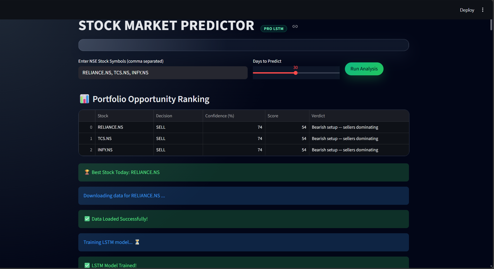

# 🚀 AI Stock Market Predictor (Pro LSTM)

An advanced AI-powered stock market prediction system built using **Deep Learning (LSTM)**, **technical indicators**, and **intelligent decision logic**.

This project analyzes historical stock data, predicts future prices, and generates **BUY / SELL / HOLD** signals with confidence and human-readable reasoning.

---

## 📸 Project Preview


---

## 🔥 Key Features
- 📈 LSTM-based stock price prediction
- 📊 Technical indicators:
  - RSI
  - MACD
  - SMA / EMA
  - Bollinger Bands
  - ADX & ATR
- 🤖 AI-powered BUY / SELL / HOLD decision engine
- 🎯 Confidence scoring for each decision
- 📉 Backtesting & strategy evaluation
- 🧠 Self-learning accuracy tracking
- 💻 Interactive Streamlit dashboard (dark TradingView-style UI)

---

## 🛠️ Tech Stack
- **Python**
- **TensorFlow / Keras (LSTM)**
- **Pandas, NumPy**
- **Matplotlib**
- **Scikit-learn**
- **Streamlit**
- **Yahoo Finance API**

---

## ▶️ How to Run
```bash
pip install -r requirements.txt
streamlit run app.py
